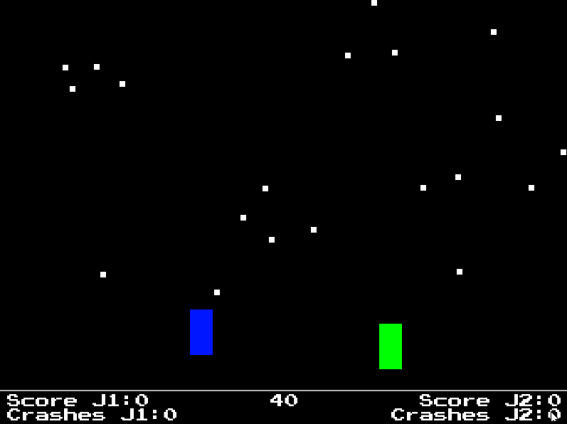

# Asteroids Race [base]

Base de jeu inspirée de Space Race (1973), second jeu créé par Atari après Pong. Créé pour servir de support lors des ateliers « Code Club » du [Cimelab](https://www.aucoindujeu05.fr/fablab/) à Briançon. C’est exprès si le son et les images sont minimalistes : l’exercice est justement de les améliorer.

Chaque joueur doit amener son vaisseau (qui peut avancer ou reculer gràce aux flèches directionnelles haut et bas) de l’autre côté de l’écran, en évitant les astéroïdes, le plus de fois possibles avant que le chronomètre ne tombe à 0. À améliorer (graphismes, sons, etc.) ou simplement  à modifier sans vergogne ! 

Vous pouvez tester le jeu en ligne [ici](https://aucoindujeu.github.io/base-asteroidsrace/).

Pistes d’évolution : 

- vous pouvez modifier les sprites à partir des fichiers situés dans le dossier [src/images/](https://github.com/aucoindujeu/base-asteroidsrace/tree/main/src/images)

- vous pouvez modifier les sons à partir des fichiers situés dans le dossier [src/sons/](https://github.com/aucoindujeu/base-asteroidsrace/tree/main/src/sons)

- et remplacer la police située dans le dossier [src/polices/](https://github.com/aucoindujeu/base-asteroidsrace/tree/main/src/polices)

## Usage
<!-- TODO -->

Pour lancer le jeu :

        make play

En faire une version exécutable sur le web (avec love.js) : 

        make js

## Licences

Ce projet est distribué d'après les termes de la licence [GNU AGPL version 3](./LICENSE.txt). Même si vous n'en avez pas l'obligation, merci de bien vouloir mentionner que le projet a été initialement créé par la ludothèque de Briançon [Au Coin du Jeu](https://www.aucoindujeu05.fr/) ☺️

Les bibliothèques et éléments tiers (polices, etc.) sont distribués sous leurs licences propres.

La police Press Start, par [Codeman38](http://www.zone38.net/font/#pressstart), est distribuée sous la licence [OFL](https://scripts.sil.org/cms/scripts/page.php?item_id=OFL_web).

La bibliothèques [classic](https://github.com/rxi/classic), créée par [rxi](https://github.com/rxi), est distribuée sous la licence [MIT](https://mit-license.org/)
